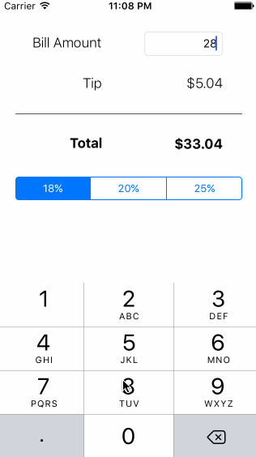

# Codepath Tip Calculator Application

This is an iOS demo application for calculating a tip for a restaurant bill.

Time spent: 30 minutes

Completed user stories:

 * [x] Required: User can enter the amount of their bill and calculate three different tip amounts.

Walkthrough of story:

GIF created with [LiceCap](http://www.cockos.com/licecap/).
